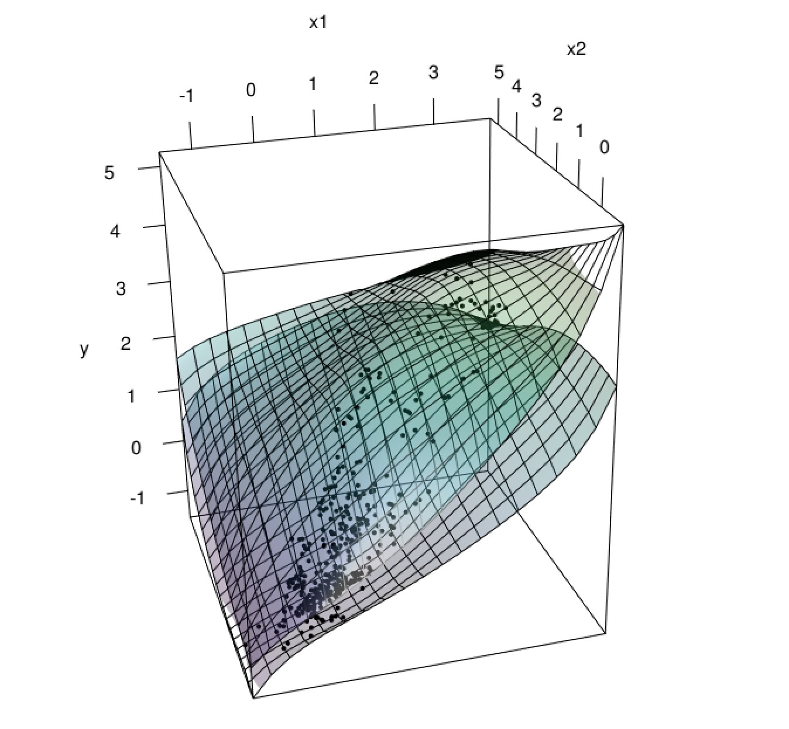
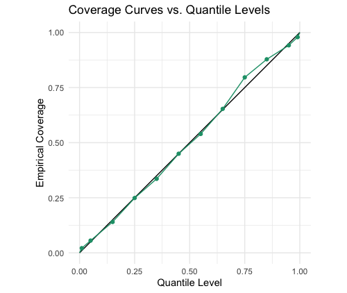

# Nonparametric Distributional Regression via Quantile Regression

This repository contains an implementation of a nonparametric distributional regression method, along with cross-validation procedures to evaluate its performance.

## Structure

```
distributional_regression/
├── README.md                # Project description
├── data/                    # Data directory
│   ├── CPI_data.xlsx        # Dataset for experiment 1 (CPI from FRED)
|   └── Folds5x2_pp.xlsx     # Dataset for experiment 2 (Combined Cycle Power Plant from UCI Data)
├── functions/               # Functions directory
│   ├── quantile-functions.R # Basis quantile functions definitions
│   ├── utils-functions.R    # Utility functions
│   ├── optimization-setup.R # Variable setup for optimization
│   ├── prediction.R         # Prediction functions
│   └── evaluation.R         # Evaluation metrics and plots (CRPS, coverage rate, 3d plot)
├── main_exp1.R              # Experiment 1: Visualization
└── main_exp2.R              # Experiment 2: Cross validation
```


## Usage

Run the full analysis including data preprocessing, optimization, prediction, and evaluation.
```r
source("main_exp1.R")
```

The 3D plot below depicts the quantile surfaces of confidence levels p = 0.05 and p=0.95 in Experiment 1. The black dots are the data points. The quantile surface is the conditional p-quantile of the response variable as a function of the features. The surfaces do not cross each other by definition of the model.



<!---

--->


The coverage curve below shows the out-of-sample coverage rate of the model at the p-quantile as a function of the confidence level p. The empirical coverage rate is defined as the percentage of data points that fall below the p-quantile surface.  The results align reasonably well with the perfect coverage line, represented by the black line.





<!---

--->

## Model Description

The proposed model is a new approach to estimating
the distribution of a response variable
conditioned on factors. We model the
conditional quantile function as a mixture
(weighted sum) of basis quantile functions,
with weights depending on these factors.
The estimation problem is formulated as
a convex optimization problem solved efficiently by Gurobi. The objective
function is equivalent to the continuous
ranked probability score (CRPS).
This approach can be viewed as conducting
quantile regressions for all confidence levels
simultaneously while inherently avoiding
quantile crossing. We use spline functions
of factors as a primary example for the
weight function.

